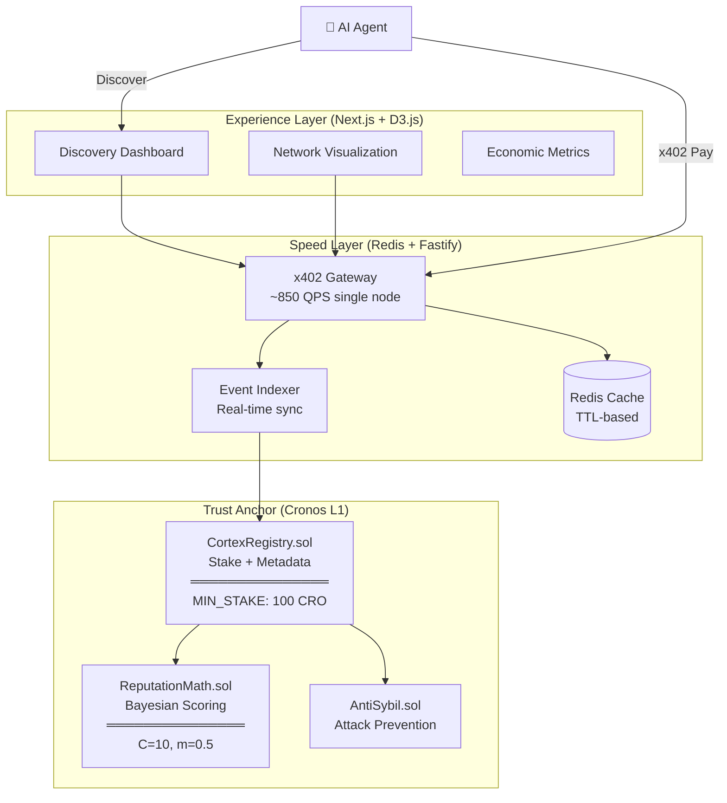

# 🧠 CortexRegistry

> **The App Store Trust Layer for AI Agents**  
> *Stop AI agents from getting scammed. Math-based fraud prevention, not star ratings.*

[](https://cronos.org)
[](https://github.com/coinbase/x402)
[](https://github.com)
[](LICENSE)

---

## 🎯 What Makes Us Different?

> **Think Uber driver ratings, but for AI services — and on-chain.**

| | CortexRegistry | Traditional Registries |
|---|---|---|
| **Trust** | Smart Reputation (on-chain, verifiable) | Star ratings (gameable) |
| **Security** | Stake ≥100 CRO + 30% Slash for cheaters | No economic penalties |
| **Result** | Cheating is expensive → Honest services win | Hope for the best |

### The Problem

In the emerging agentic economy, AI agents need to discover and consume external services (MCP endpoints). But how does an agent know which service to trust?

- **Star ratings?** Easily gamed with fake reviews
- **Centralized approval?** Single point of failure
- **Free registration?** Spam and low-quality services

### Our Solution: The Trust Layer

CortexRegistry makes cheating **economically irrational**:

1. **Stake to Play**: Services must deposit ≥100 CRO to register. No free lunch.
2. **Cheat and Lose**: 30% penalty for bad behavior. Scammers lose money.
3. **Earn Trust Gradually**: New services start with neutral reputation. ~10 good interactions to prove yourself.
4. **Math, Not Hope**: Honest operation is always the best strategy. Verified on-chain.

---

## 🏛️ Architecture: Protocol-Grade Design



---

## 🔬 Core Mechanisms

### 1. Bayesian Reputation Scoring

Unlike simple averages, our Bayesian approach:

```
Score = (n × avg + C × m) / (n + C)

Where:
  n = number of ratings
  avg = average rating
  C = prior weight (10)    ← New services regress to mean
  m = prior mean (0.5)     ← Prevents instant 5-stars
```

**Result**: A service needs ~10 verified interactions to establish credible reputation.

### 2. Nash Equilibrium Staking

```
Condition: Stake > (1-p) × α / p

Where:
  p = probability of being caught cheating
  α = slashing ratio (30%)

When Stake = 100 CRO and α = 30%:
  → Honest operation is always the optimal strategy
  → No rational actor will cheat
```

### 3. State Machine Governance

```
Pending → Active → [Challenged] → Slashed | Withdrawn
    ↓         ↓           ↓
  Stake    Operate    Defend/Fail
```

---

## 🛠️ Tech Stack

| Layer | Technology | Why |
|-------|------------|-----|
| **Contracts** | Foundry + Solidity 0.8.x | Gas-efficient, security-audited |
| **Backend** | Fastify + Viem + Redis | ~850 QPS, event-driven indexing |
| **Frontend** | Next.js 14 + D3.js | Interactive star map visualization |
| **Payment** | x402 Protocol | HTTP-native, no API keys |

---

## 📜 Deployed Contracts (Cronos Testnet)

| Network | Contract | Address | Explorer |
|---------|----------|---------|----------|
| Cronos Testnet (338) | CortexRegistry | `0xfe5f7b0ae5018eb2853c31fc28c4c9a339052587` | [View](https://cronos.org/explorer/testnet3/address/0xfe5f7b0ae5018eb2853c31fc28c4c9a339052587) |

---

## 🚀 Quick Start

### Prerequisites

- Node.js ≥ 18.x
- pnpm ≥ 8.x  
- Docker (for Redis)
- Foundry (for contracts)
- Cronos Testnet TCRO from [Faucet](https://cronos.org/faucet)

### Installation

```bash
# Clone & install
git clone https://github.com/YOUR_USERNAME/cortex-registry.git
cd cortex-registry && pnpm install

# Start infrastructure
docker-compose up -d                      # Redis
cd packages/contracts && forge build      # Compile contracts

# Configure
cp .env.example .env                      # Add RPC endpoints + private key

# Run
pnpm --filter gateway dev                 # Gateway @ :3001
pnpm --filter dashboard dev               # Dashboard @ :3000
```

### Verify

```bash
curl http://localhost:3001/health | jq    # Should show "healthy"
curl http://localhost:3001/v1/discover    # Service list or 402
```

---

## 🤖 Cortex Traveler: Autonomous AI Agent

Meet **Cortex Traveler**, a self-sovereign AI agent that autonomously discovers, verifies, and consumes services on CortexRegistry.

### Core Capabilities
- **🧠 DeepSeek V3 Brain**: Analyzes service metadata to select the best provider for a given goal.
- **💸 x402 Native Payment**: Pays for services directly on-chain using the x402 protocol.
- **🛡️ Verifiable Consumption**: All interactions are signed and logged on-chain and visualized in the dashboard.

### Usage

Ensure you have configured `DEEPSEEK_API_KEY` and `AGENT_PRIVATE_KEY` in `.env`.

```bash
# Single Run: Give the agent a specific goal
pnpm exec tsx scripts/cortex-traveler.ts "I need weather data for Tokyo"

# Autonomous Loop: Let the agent roam the network
pnpm exec tsx scripts/cortex-traveler.ts --loop
```
For Reviewers: To experience the Cortex Registry immediately without waiting for blockchain indexing, use the Mock Mode:

MOCK_MODE=true npm run dev (in apps/gateway)
---

## 📊 Performance & Security

### Benchmarks

| Metric | Result | Notes |
|--------|--------|-------|
| **Gateway QPS** | ~850 | Single node, scalable to 10k+ |
| **Cache Hit Rate** | >90% | With Redis warmup |
| **Contract Gas** | <200k | registerService() |

### Security Audit

```bash
slither packages/contracts/src/ --exclude-dependencies
# Result: 0 high-severity vulnerabilities
```

---

## 🧪 Testing

```bash
# Contract tests (46 cases)
cd packages/contracts && forge test --gas-report

# Integration tests (11 cases)
pnpm --filter gateway test:integration

# Load tests
k6 run tests/load/load.js
```

---

## 📁 Project Structure

```
cortex-registry/
├── apps/
│   ├── gateway/          # x402 Gateway (Fastify)
│   └── dashboard/        # Discovery UI (Next.js)
├── packages/
│   ├── contracts/        # Smart Contracts (Foundry)
│   │   └── src/
│   │       ├── CortexRegistry.sol
│   │       └── lib/
│   │           ├── ReputationMath.sol
│   │           └── AntiSybil.sol
│   └── sdk/              # TypeScript types
├── scripts/              # Deployment & utilities
└── docs/                 # Specifications
```

---

## 🎬 Demo

See [`docs/demo_script.md`](docs/demo_script.md) for a 3-minute walkthrough:

1. **D-01**: Agent discovers services autonomously
2. **D-02**: x402 payment flow (402 → Pay → 200)
3. **D-03**: D3.js star map visualization
4. **D-04**: Slashing mechanism in action
5. **D-05**: Performance benchmark proof

---

## 🔮 Roadmap

### Current: Hackathon MVP
- ✅ On-chain registry with stake-based security
- ✅ Bayesian reputation scoring
- ✅ x402 payment protocol integration
- ✅ AI Agent autonomous operation (Cortex Traveler)

### Next: Protocol Economics
- **Query Fee**: x402-powered discovery API monetization
- **Transaction Routing**: Protocol fee on service payments
- **Reputation Staking**: Non-transferable on-chain reputation
- **Multi-Asset Support**: Beyond MCP to APIs, datasets, compute

---

## 🔗 Links

- **Hackathon**: [Cronos x402 Paytech Hackathon](https://dorahacks.io)
- **x402 Protocol**: [coinbase/x402](https://github.com/coinbase/x402)  
- **Cronos Testnet**: [Explorer](https://cronos.org/explorer/testnet3)

---

## 📄 License

MIT License - see [LICENSE](LICENSE) for details.

---

<p align="center">
  <strong>🛡️ The Trust Layer for AI Services</strong><br/>
  <em>Stop AI agents from getting scammed</em><br/><br/>
  Built with ❤️ for the Cronos x402 Paytech Hackathon
</p>
